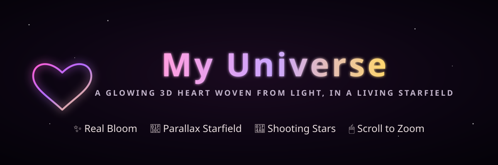
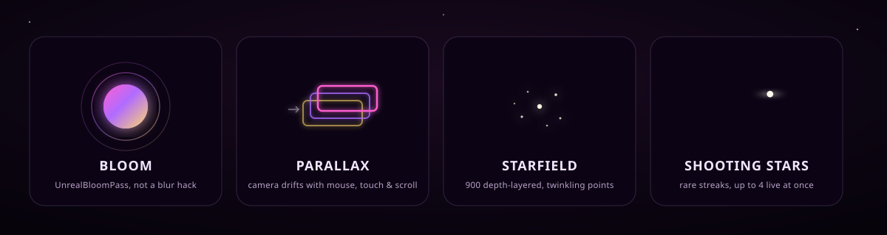
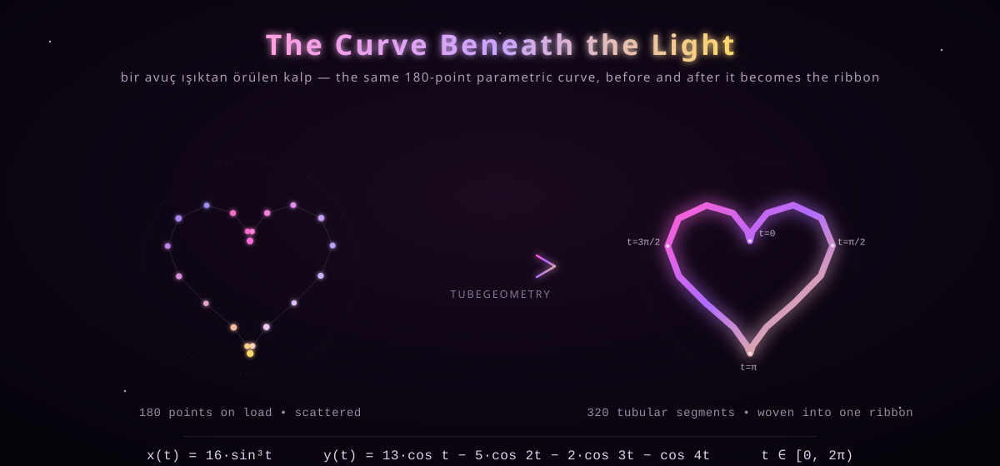
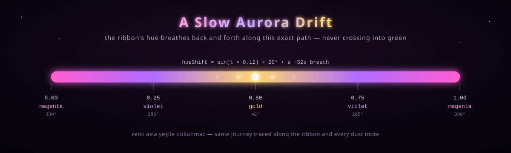

<div align="center">



# 💫 My Universe

*A glowing 3D heart, woven from light, adrift in its own galaxy.*

**"In every lifetime, I'd find you again."**

[](LICENSE)
[](https://threejs.org/)
[](#-run-it-locally)
[](#the-bloom-pipeline)

**[✨ Open the live piece ✨](https://furkiozknn.github.io/kalp-animasyon/)**

</div>

<br>

A single HTML file, a scattering of vanilla JavaScript, and [Three.js](https://threejs.org/) — that's the entire ingredient list. No framework, no bundler, no build step. Load the page and a heart forms itself out of stardust: a single unbroken ribbon of light traced along a real parametric curve, wrapped in bloom, drifting through a living starfield that occasionally streaks with a shooting star. Move your mouse, or tilt your phone, and the whole galaxy leans with you.

This README walks through what it looks like, how it's built, and how to run it yourself.

<br>

## 📖 Table of Contents

- [The Visual Experience](#-the-visual-experience)
- [The Curve Beneath the Light](#-the-curve-beneath-the-light)
- [A Slow Aurora Drift](#-a-slow-aurora-drift)
- [The Technical Craft](#-the-technical-craft)
  - [Scene, camera, renderer](#scene-camera-renderer)
  - [The bloom pipeline](#the-bloom-pipeline)
  - [Building the heart from a formula](#building-the-heart-from-a-formula)
  - [Stardust and starfield](#stardust-and-starfield)
  - [Shooting stars](#shooting-stars)
  - [The entrance, and the living loop](#the-entrance-and-the-living-loop)
  - [Parallax and zoom](#parallax-and-zoom)
- [Run It Locally](#-run-it-locally)
- [Project Structure](#-project-structure)
- [Stack & Credits](#-stack--credits)
- [License](#-license)

<br>

## 🎨 The Visual Experience

On load, nothing exists yet — just a starfield and silence. Then, over about three seconds, scattered points of light rush inward from the dark and knit themselves, segment by segment, into a single glowing ribbon: **the heart**. It keeps breathing after that — a slow pulse, a slow turn, never fully still.

Four things carry the piece. Each is real, running live in your GPU, not a pre-baked video:



| | |
|---|---|
| ✨ **Bloom** | The glow is genuine HDR bloom via `UnrealBloomPass` — light bleeding into the dark around it — not a CSS filter or a blurred sprite. |
| 🖱️ **Parallax** | The camera eases toward your mouse, your finger, or your device's tilt. Scroll or pinch to zoom the whole scene in and out. |
| 🌌 **Starfield** | 900 depth-layered points fill the background, each twinkling on its own independent phase and speed. |
| 💫 **Shooting stars** | Every few seconds, a streak crosses the sky — up to four alive at once, each fading out on its own arc. |

Underneath the motion sit two more deliberate design choices, both worth a closer look: the **curve** the heart is built from, and the **color** it drifts through.

<br>

## 🧵 The Curve Beneath the Light

The heart isn't a modeled mesh or an imported asset — it's math. A classic parametric heart curve is sampled at 180 points, and a `THREE.TubeGeometry` is skinned around the resulting `CatmullRomCurve3`, turning a 1D line into a 3D ribbon with real thickness, real lighting, real depth.



On load, those 180 points don't just appear — they're revealed **segment by segment** along the tube's `drawRange`, so the ribbon looks like it's being drawn by hand, tracing itself into existence out of the dark. A gentle sine wave on the z-axis keeps the curve from ever going perfectly flat, so the heart always reads as an object in space, not a decal.

<br>

## 🌈 A Slow Aurora Drift

The ribbon's color isn't a static gradient — it's alive. Every vertex is colored along a hue ramp that drifts back and forth over roughly a minute, magenta into violet into gold and back, **deliberately routed around the hue wheel so it never once passes through green**. The same hue math colors every stardust mote orbiting the heart.



It's a small detail most visitors will never consciously notice — and that's rather the point. It just feels *right*, the way a well-graded film feels right.

<br>

## ⚙️ The Technical Craft

Everything below runs inside `script.js` — roughly 400 lines, no external assets besides two Google Fonts and the Three.js CDN import.

### Scene, camera, renderer

- `WebGLRenderer` with antialiasing, capped device-pixel-ratio (max 2, for performance headroom on high-DPI displays), `SRGBColorSpace` output, and `ACESFilmicToneMapping` at `0.95` exposure for filmic, non-blown-out highlights.
- `FogExp2` gives the scene depth without a hard horizon — distant stars and dust quietly dim rather than clip.
- A `PerspectiveCamera` (50° FOV) sits at a base distance that adapts to aspect ratio, so tall/portrait phone screens automatically pull back to keep the whole heart in frame.

### The bloom pipeline

```js
const composer = new EffectComposer(renderer);
composer.addPass(new RenderPass(scene, camera));
composer.addPass(new UnrealBloomPass(resolution, 0.85 /*strength*/, 0.4 /*radius*/, 0.45 /*threshold*/));
composer.addPass(new OutputPass());
```

This is a real HDR post-processing chain, not a filter. Only pixels brighter than the `0.45` threshold bleed outward, which is why the ribbon glows and the deep-space background stays inky black.

### Building the heart from a formula

```js
function heartRaw(t) {
  const x = 16 * Math.pow(Math.sin(t), 3);
  const y = 13 * Math.cos(t) - 5 * Math.cos(2 * t) - 2 * Math.cos(3 * t) - Math.cos(4 * t);
  return { x, y };
}
```

180 samples of `t ∈ [0, 2π)` become a closed `CatmullRomCurve3` (tension `0.55`), which `TubeGeometry` skins into 320 tubular segments × 8 radial segments — a proper 3D ribbon, not a flat outline. Vertex colors are computed once per animation frame from a **cached** per-segment hue table (`tubeBaseHue`), so the per-frame cost is just adding a scalar hue shift to 321 precomputed values instead of recomputing hue math for every vertex, every frame.

### Stardust and starfield

- **260 stardust points** drift around the ribbon's own curve with per-particle jitter and flicker, colored by the same hue table as the ribbon. On entrance they fly in from random positions scattered across the scene, arriving exactly as the ribbon finishes forming.
- **900 background stars** are scattered across a spherical shell (radius 22–55) behind the heart, each with a random twinkle phase and speed, rendered through a custom `ShaderMaterial` with additive blending and distance-based point-size attenuation.

### Shooting stars

A small pool of four reusable `THREE.Line` segments spawns at random intervals (roughly every 3–8 seconds), each with its own head position, velocity, and fading tail alpha — recycled rather than recreated, so there's zero garbage-collection stutter even after hundreds of streaks.

### The entrance, and the living loop

Time is tracked as an accumulated `simTime` built from a **clamped delta**, not `clock.getElapsedTime()` — so if you background the tab for ten minutes, the animation doesn't try to "catch up" and jump on return; it just resumes smoothly. The entrance itself eases with a cubic-out curve over ~2.9 seconds, after which the heart settles into a permanent, gentle idle: a gentle scale-breathing pulse, a slow self-rotation, and a soft tilt.

### Parallax and zoom

Mouse position, touch position, and scroll delta all feed into eased targets that the camera chases every frame (`ease = dt × 2.2`, clamped) — never snapping, always gliding. Scroll or pinch adjusts a `zoom` value clamped to `[-1, 1]` that pushes the camera distance in or out.

<br>

## 🧑‍💻 Run It Locally

The page loads Three.js via an ES module import map, which browsers refuse to resolve over `file://` — so it needs a real (if trivial) local server:

```bash
npx serve .
```

Then open the printed local URL. That's the entire setup — no `npm install`, no build, no config.

<br>

## 📁 Project Structure

```
kalp-animasyon/
├── index.html              entry point — fonts, import map, overlay text
├── styles.css               overlay typography, shimmer & fade animations
├── script.js                the entire scene: heart, bloom, stars, input
├── LICENSE                  MIT
└── assets/
    ├── banner.svg            hero banner
    ├── heart-curve-math.svg  the parametric curve, explained visually
    ├── color-journey.svg     the magenta → violet → gold hue drift
    └── feature-icons.svg     bloom / parallax / starfield / shooting stars
```

<br>

## 🛠️ Stack & Credits

Plain HTML, CSS, and JavaScript — [Three.js](https://threejs.org/) r160, loaded straight from a CDN via an import map, no bundler in sight. Display type is set in [Cormorant Garamond](https://fonts.google.com/specimen/Cormorant+Garamond) and [Cinzel](https://fonts.google.com/specimen/Cinzel) via Google Fonts; the README graphics use [Orbitron](https://fonts.google.com/specimen/Orbitron) for headings, all hand-authored SVG matching the scene's own palette.

<br>

## 📄 License

MIT — see [LICENSE](LICENSE).

<br>

<div align="center">

*made for one, shared with everyone*

</div>
